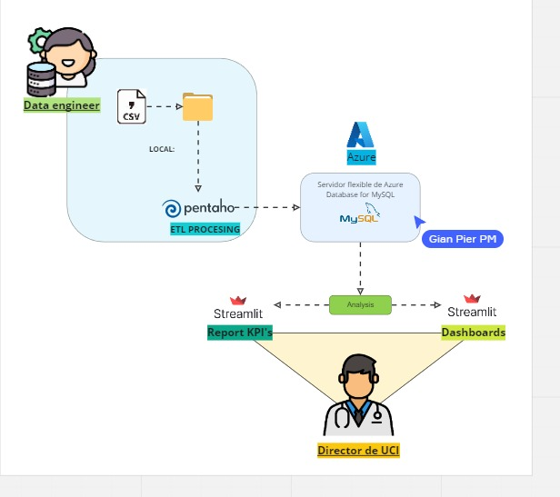

# 
 **PROYECTO FINAL DE HENRY** 

## 
 **Unidad de Cuidados Intensivos** 🏥 

## **Contexto:**

Crowe Clinic, una importante clínica fundada en 1979, ha atendido a más de 3 millones de pacientes. Ubicada en el centro de Ohio, Estados Unidos, ha notado que desde el 2019 ingresan muchos pacientes a UCI y que consumen muchos recursos, no dándose a basto para atender a todos y tener que derivarlos a otras clínicas u hospitales cercanos. 

Por ello, le solicita a DataSight Consulting una solución de arquitectura de datos para la gestión de los datos de a unidad de cuidados intensivos con el fin de poder prever lo necesario para atender mejor a los pacientes.

Para lo cual nuestro equipo una propuesta documentada en el siguiente [link](https://docs.google.com/document/d/1_895Cu2QYf9E-fesB26-OHNRjTFM75Z1QXwxzG4fDMU/edit?usp=sharing)

Dicha propuesta se basa en la contrucción de una base de datos usando MySQL como sistema de gestión de base de datos,Azure Database for MySQL que administra la base de datos en la nube y Pentaho que orquesta la carga incremental y realiza la validación de nuevos datos. Tambien se incluye un dashboard para visualizar los KPI's, el analisis descriptivo de los datos y el historial clinico de los pacientes.

## **Analisis exploratorio de los datos**

Se realizó un EDA preliminar que se encuentra en el notebook [EDA_UCI/EDA.ipynb](./EDA_UCI/EDA.ipynb) y muestra la calidad d elos datos iniciales entregados al equipo.

Tambien de manera mas detallada se documentó la información de cada tabla y columna de los datasets en el siguiente [archivo](https://docs.google.com/document/d/1qNbqdp1vyyjqQCUWzDa5z6q7lKnvOe-n/edit?usp=sharing&ouid=108306859673488732868&rtpof=true&sd=true)

## **Flujo de datos**

En la imagen anterior se puede observar el flujo de datos desde que los nuevos datos son ingestados en la carpeta LOAD_DATA para ser procesados y transformados en Pentaho, que posteriormente los carga a la base de datos almacenada en la nube de Azure, de la cuál obtiene la información el dashboard donde se puede visualizar la información para la toma de decisiones.

El proceso de carga incremental se encuentra grabado en el siguiente[video](https://drive.google.com/file/d/1D-CtyQ9ARGTscI2Wggwolqh2eRqtMEPH/view?usp=share_link)

Para la administración de la base de datos y el manejo de los datos en si se tienen en cuenta ciertas reglas de válidación contenidas en [este documento](https://docs.google.com/document/d/1f_YqEtrdooUeR0LkfJ0gMN4heqkShRqN/edit?usp=sharing&ouid=108306859673488732868&rtpof=true&sd=true)

## **Dashboard**

 El dashboard fue desarrollado en Streamlit.Puedes acceder a traves del siguiente [link](https://crowe-clinic.streamlit.app/)

## **Metodologia Scrum**

La actividades estan consignadas en [Trello](https://drive.google.com/file/d/1u--2PKjkibFuT1ckgNZX-Pd_kjpCh_LC/view?usp=sharing)

## **Stack tecnologico**

- Azure Database for MySQL
- MySQL
- Pentaho
- Python
  * Pandas
  * Plotly
  * Streamlit

## **Propuestas futuras para el proyecto**

- Aplicación de Machine Learning para predecir si un paciente tiene alta probabilidad de cambiar a un estado critico, para priorizar su atención

